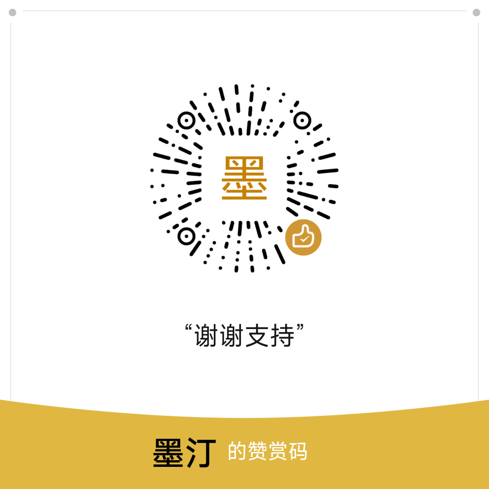

<div align="center">

# LinkGo · 链接跳转

**让链接不再被应用绑架 —— 复制即跳转，屏幕取链，一键直达目标应用。**

Android 10+ · LSPosed / Shizuku / Root · Jetpack Compose


[](https://github.com/mting1117/LinkGo/releases)
[](https://developer.android.com)
[](https://kotlinlang.org)
[](#许可协议)

</div>

> **开发方式声明**
>
> 本项目是**个人业余作品**。开发者**并非 IT 行业从业者**，编码完全出于个人爱好，纯粹是「自己用得上，就顺手做出来」。
>
> 项目**绝大部分代码由 AI 协作完成**，主要使用 **Gemini** 与 **DeepSeek** 两款模型。开发者负责提出需求、验证效果、把控方向与反复调试，代码实现主要交给 AI。
>
> 因此，本项目可能存在架构不够严谨、实现不够优雅之处，欢迎指正，也请对代码质量保持合理预期。

---

## 这是什么

LinkGo 解决一个很具体的烦恼：**你在 A 应用里复制了一条链接，却只能用系统默认浏览器或它自己指定的应用打开**。

它常驻在系统层替你盯着剪贴板与屏幕，一旦发现链接，就按你预设的规则把这条链接送进**你想用的那个应用**。支持正则匹配、链接模板改写、短链预解析、二维码识别，以及从屏幕上直接"抓"出链接。

> **一句话**：把每一条链接，交给它真正该去的地方。

## 功能特性

### 剪贴板监听（6 种后端可选）

不强制依赖单一提权方式，按你的设备情况自选：

| 后端 | 提权方式 | 监听方式 | 说明 |
|---|---|---|---|
| **LSPosed** | 框架层 | 系统写入点 Hook | 零常驻，最轻量 |
| **Shizuku + 隐藏 API** | Shizuku | 系统隐藏 API | **默认**，需编译 DEX 组件 |
| **Root + 隐藏 API** | Root | 系统隐藏 API | 提权直连 |
| **Shizuku + logs** | Shizuku | 系统日志轮询 | 兼容兜底 |
| **Root + logs** | Root | 系统日志轮询 | 兼容兜底 |
| **无** | — | 仅公开监听 | 不注入，最保守 |

### 取链方式

- **滑动直达（Radar）**：手指滑过屏幕上的链接即时高亮，松手极速跳转，不打断当前操作
- **屏幕识别**：静默截图并智能提取页面内全部网页链接，支持区域框选
- **剪贴板分析**：深度解析剪贴板最新内容，支持图片与二维码解码
- **边缘手势热区**：可调宽高 / 位置 / 透明度 / 双侧镜像，支持点击、滑动、长按三种动作绑定，并按**屏幕方向**与**应用黑白名单**限定生效范围

### 规则系统

- **分发规则**：按来源应用 + 正则匹配，决定链接发往哪个应用
- **跳转规则**：正则捕获 + 模板改写（`$1` 回填），可对短链做预解析
- **图片规则**：图片分享的目标应用绑定
- **提取规则（ExtractPattern）**：从混杂文本中抽取链接的独立判据
- **豁免域名**：来源应用与域名组合白名单，避免误拦
- **解析策略**：不解析 / 解析并执行本规则 / 解析并二次分发

### 其他

- **雷达与高亮**：屏幕链接自动高亮浮层，支持无障碍事件穿透，杜绝游戏误触
- **快捷磁贴**：通知栏磁贴一键切换剪贴板监听与高亮器
- **备份与恢复**：规则与配置完整导出导入
- **跳转历史**：可回溯每一条链接的去向
- **系统适配**：HyperOS 超级岛通知、应用解冻、进程保活等深度适配

## 系统要求

| 项目 | 要求 |
|---|---|
| Android 版本 | **10（API 29）及以上** |
| 设备架构 | **arm64-v8a** |
| 提权方式 | 三选一：**LSPosed** / **Shizuku** / **Root** |
| 目标 SDK | 36（编译 SDK 37） |

> 不装任何提权手段也能安装运行，但剪贴板后台监听会退化为"仅公开监听"模式。

## 安装使用

### 1. 安装应用

从 [Releases](https://github.com/mting1117/LinkGo/releases/latest) 下载最新 APK 安装。

### 2. 授予权限

按你选择的提权方式操作：

- **LSPosed**：在 LSPosed 管理器中启用 LinkGo 模块，作用域勾选**系统框架**（`system`），然后重启作用域
- **Shizuku**：安装 [Shizuku](https://shizuku.rikka.app/)，启动服务后回到 LinkGo 授权
- **Root**：直接授予 Root 权限

### 3. 开启所需能力

进入「设置 → 权限中心」逐项开启：

- **无障碍服务**：屏幕链接识别与高亮所需
- **悬浮窗**：边缘热区与雷达浮层所需
- **通知权限**：前台服务常驻所需
- **忽略电池优化**：防止后台监听被系统杀死
- **读取应用列表**：跳转目标选择所需（部分系统默认禁止，需在系统设置中手动放行）

### 4. 配置规则

底部导航分三个页签：**分发规则 / 跳转规则 / 图片规则**。新增规则时填入正则与方法，即可让链接按你的意愿流转。

## 从源码构建

### 环境要求

- JDK **11+**
- Android SDK **Platform 37** + **Build-Tools**（需含 `d8`）
- Gradle **8.13**（仓库自带 Wrapper，无需另装）

### 配置签名

构建 release 包需要签名信息。在项目根目录创建 `local.properties`（**已被 `.gitignore` 排除，不会入库**）：

```properties
sdk.dir=你的 Android SDK 路径
SIGNING_KEY_ALIAS=你的密钥别名
SIGNING_STORE_PASSWORD=密钥库口令
SIGNING_KEY_PASSWORD=密钥口令
```

密钥库文件放置在 `signing/moting`。

### 构建

```bash
# 编译调试包（首次会先编译 DEX 组件）
./gradlew assembleDebug

# 编译正式包（开启混淆与资源压缩）
./gradlew assembleRelease

# 仅做 Kotlin 语法自检
./gradlew compileDebugKotlin
```

产物输出为 `LinkGo_<versionName>.APK`。

> **注意**：`preBuild` 依赖 `compileDex` 任务，它会用 `javac` + `d8` 把 `dex_src/` 下的 Java 源码编译成 DEX，并打包为 `app/src/main/assets/listener.zip`。因此**构建机必须配置好 Android SDK 与 Build-Tools**，否则会直接中断。

## 技术栈

| 领域 | 选型 |
|---|---|
| 模块框架 | libxposed API 102（LSPosed） |
| 界面 | Jetpack Compose + Material 3 + Navigation Compose |
| 提权 | Shizuku 13.1.5 / Root |
| 隐藏 API | HiddenApiBypass |
| 二维码 | ZXing Core |
| 配置存储 | DataStore Preferences |
| 网络 | OkHttp |
| 序列化 | Gson |
| 构建 | AGP 8.13.2 / Kotlin 2.2.10 / Gradle 8.13 |

### 项目结构

```
app/src/main/java/com/moting/linkgo/
├── applink/       应用链接捕获 Hook 契约
├── clipboard/     剪贴板监听（6 后端 + 分发）
├── data/          配置仓库（SettingsRepository 等）
├── hook/          LSPosed 入口
├── image/         图片与二维码识别、屏幕截图
├── model/         数据模型（规则 / 策略 / 手势配置）
├── overlay/       悬浮层（雷达 / 边缘热区 / 剪贴板胶囊）
├── receiver/      开机自启、备份闹钟等广播接收
├── router/        跳转路由（普通 / 隐藏）
├── service/       前台服务、磁贴、Shizuku 管理
├── ui/            高亮器、选择器、规则导入
├── util/          工具集（提权、窗口路由、主题、保活）
└── viewmodel/     各页面 ViewModel
dex_src/           编译为 DEX 的剪贴板监听组件（Java）
hidden-api/        编译期隐藏 API 桩（compileOnly）
```

## 常见问题

**Q：一定要装 LSPosed 吗？**
不必。LSPosed / Shizuku / Root 三选一即可，都可用完整功能。三者都不装也能运行，只是剪贴板监听降级为公开监听。

**Q：为什么需要这么多权限？**
每项都对应具体能力：无障碍用于屏幕取链，悬浮窗用于热区与高亮，电池优化豁免用于后台常驻。应用**不含任何广告与统计分析**。

**Q：界面看不到应用列表？**
Android 11+ 收紧了包可见性。请在系统设置的「应用 → 特殊权限」中找到 LinkGo，将**读取应用列表**设为允许。

**Q：构建报错找不到 android.jar 或 d8？**
`compileDex` 任务依赖本机 Android SDK。请确认 `local.properties` 中的 `sdk.dir` 正确，且已安装 **Platform 37** 与 **Build-Tools**。

**Q：链接没有跳转？**
按顺序排查：① 剪贴板后端是否已生效（设置页会显示当前后端）② 规则是否启用且正则匹配成功 ③ 是否误命中豁免域名 ④ 后台是否被系统杀死（检查电池优化豁免）。

## 说明

- 本项目**需要系统级提权**，请确认你了解 LSPosed / Shizuku / Root 的作用与风险后再使用
- 剪贴板内容与屏幕识别**均在本地处理，不上传任何数据**
- 因本项目为个人业余作品，使用前请自行评估风险，作者不对任何设备异常或数据损失负责
- 仅供学习与个人使用，请遵守你所在地区的法律法规

## 许可协议

本仓库尚未指定开源许可证。在补充 LICENSE 之前，默认保留所有权利。

## 支持

<div align="center">

如果 LinkGo 帮到了你，欢迎扫码请作者喝杯咖啡 ☕



**感谢你的支持**

</div>

---

<div align="center">

**LinkGo** · 让每一条链接，去它该去的地方

</div>
